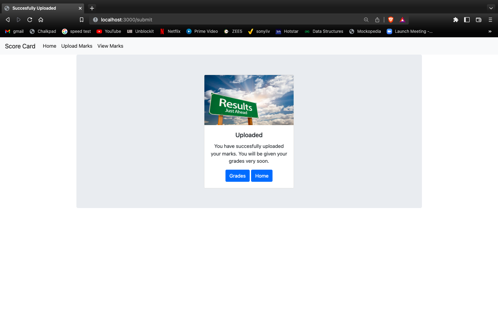
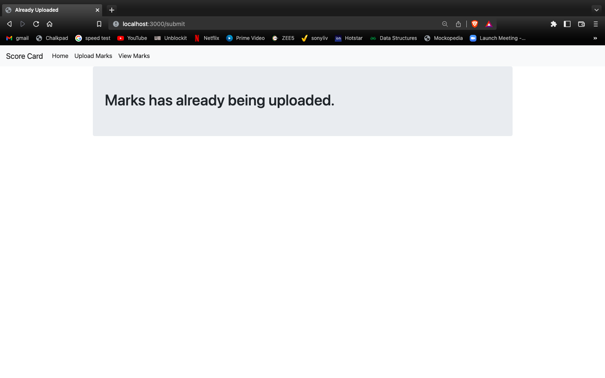
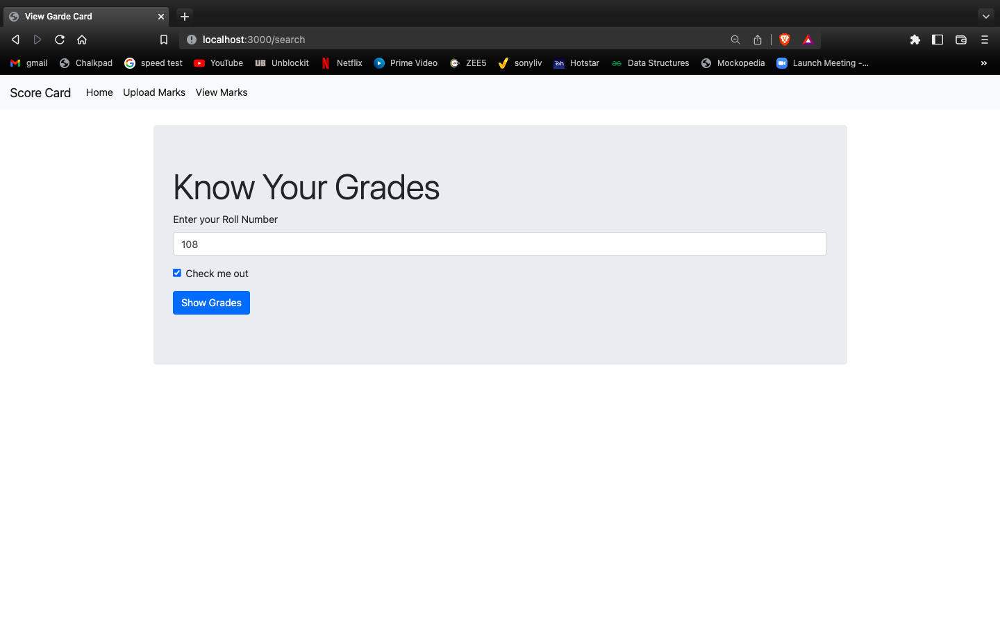
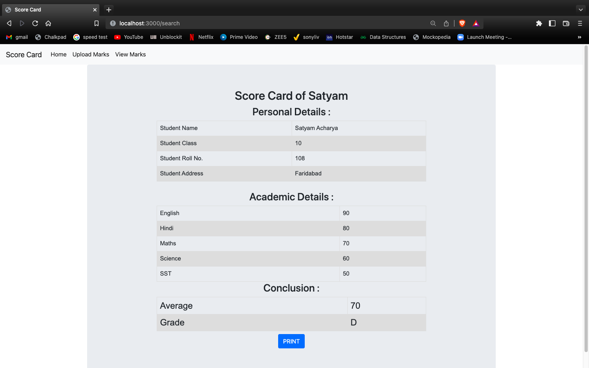
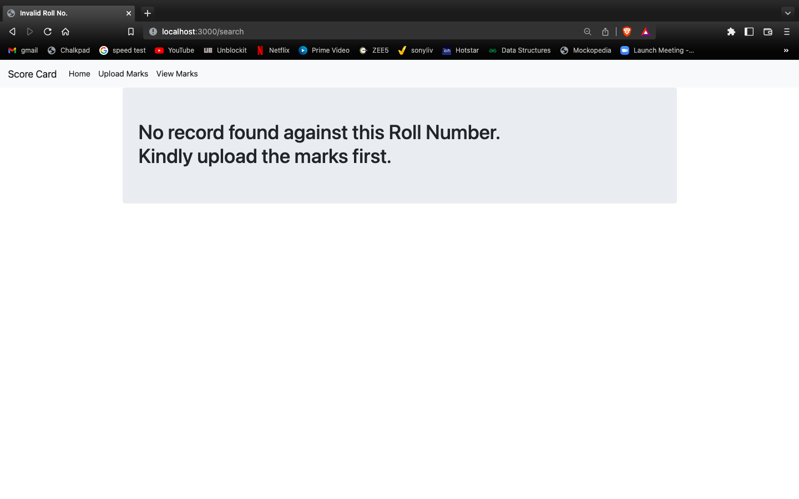
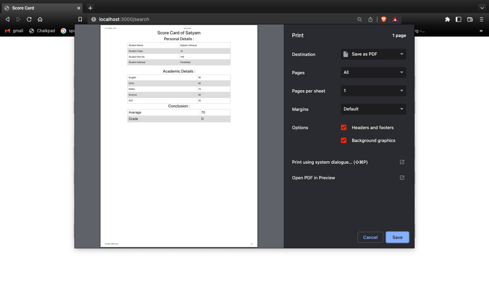

# Score Registered
Score Card & Grade Calculator in MERN STACK.

# Technology Used
NODE-JS, EXPRESS-JS, MongoDB, Mongoose, Handlebars

# Project Description
It's a Grade Calculator that user can input marks and then see their average and grade. User can print their grade card also. All the user credentials are stored in MongoDB database cluster.

# Project Features

1) It stores all the data in a MongoDb cluster so if you dont have mongodb on your local device it isn't such a issue.
2) It supports dual connectivity.
3) It has a navbar which works through out every page of the project.
4) It doesnt allows numbers to be written in place of names and vice versa.
5) It checks that marks are being uploaded only once per roll number.
6) It blocks marks to be uploaded in negative and more than hundred.
7) It shows us all the data as a scorecard and also allows us to print it
8) It calculates your AVERAGE and assigns you a GRADE accordingly.
9) You can print your scorecard.
10) The project is very much optimized.

# How to start the Project

```
npm install node
npm run dev
```
After that go to your web browser and type http://localhost:3000/

# SCREENSHOTS
 HOME PAGE


 UPLOAD YOUR MARKS

 
 MARKS UPLOADED


 IF YOU HAVE ALREADY UPLOADED THE MARKS


 SEARCH YOUR ROLL NUMBER


 SCORE CARD


 IF YOU HAVE NOT UPLOADED THE MARKS


 PRINT THE SCORE CARD


 DATABASES WHERE ITS ALL STORED


## Copyright and License

Copyright (c) 2021-2022, Vishal Sharma, Chitkara Uni, Nishchal Sir.

This project is licensed under the [MIT License](LICENSE.md).


